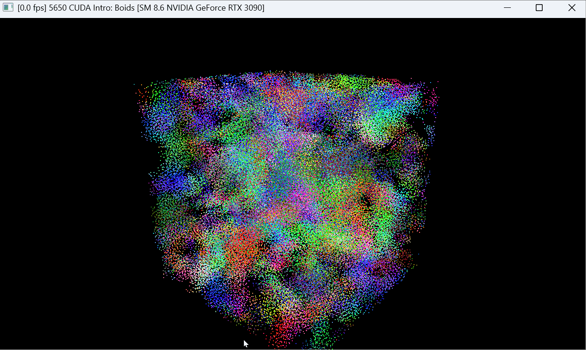
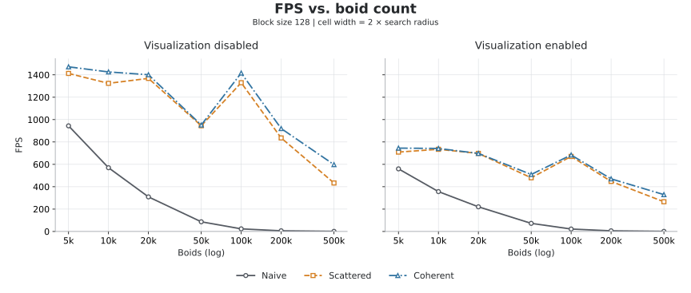
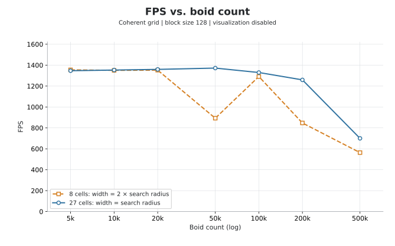
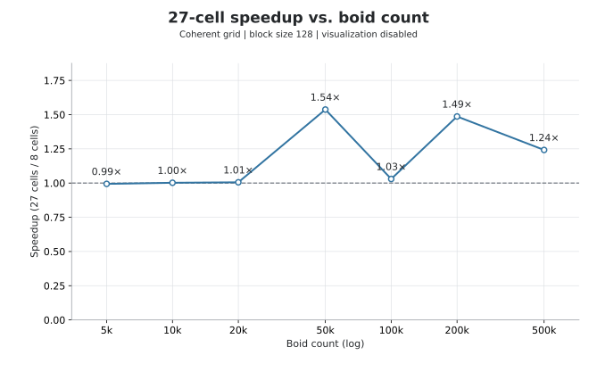

# CUDA Flocking Simulation

**University of Pennsylvania, CIS 5650: GPU Programming and Architecture,
Project 1 - Flocking**

* Sizhe Liu
  * [LinkedIn](https://www.linkedin.com/in/sizhe-liu-2726492b6/), [personal website](https://github.com/JamesLiu12).
* Tested on: Windows 11 Pro, i9-12900H @ 2.50GHz 32GB, RTX 3090 24GB (Personal Computer)

*Flocking simulation with 100,000 boids.*

## Overview

A GPU implementation of the Boids flocking model using CUDA and OpenGL. Each boid updates its motion using three local rules: cohesion, separation, and alignment. The project compares an all-pairs neighbor search with two spatial-grid implementations to explore how search strategy and memory layout affect performance.

- **Naive:** each CUDA thread updates one boid by checking all other boids. This requires $O(N^2)$ comparisons, including many distant boids that cannot influence each other.
- **Scattered uniform grid:** sorting boid indices by cell limits the search to nearby cells and reduces unnecessary comparisons. However, positions and velocities remain scattered in memory.
- **Coherent uniform grid:** positions and velocities are also reordered by cell, allowing direct access with better memory locality. This adds a reordering step but can make neighbor searches faster.

## Flocking Rules

| Rule | Behavior |
|---|---|
| Cohesion | Move toward the average position of nearby boids. |
| Separation | Move away from boids that are too close to avoid crowding. |
| Alignment | Adjust velocity using nearby boids' average velocity to encourage coordinated motion. |

## Cell Width and Neighbor Selection

Let $R$ be the largest search radius used by the flocking rules.

| Cell width | Cells checked |
|---|---|
| $2R$ | 8 |
| $R$ | 27 |

With cell width $2R$, each boid searches a group of 8 cells; with width $R$, it searches its own cell and the 26 surrounding cells.

## Performance Analysis

### Measurement Method

FPS is calculated as completed frames divided by elapsed time. Each run lasts approximately 20 seconds.

| Experiment | Variable | Fixed settings |
|---|---|---|
| Boid count | 5k, 10k, 20k, 50k, 100k, 200k, 500k | Block size 128; width `2R`; all three implementations; visualization off/on |
| Block size | 32, 64, 128, 256, 512, 1024 | 50k boids; width `2R`; all three implementations; visualization off/on |
| Cell width | Width `2R` / 8 cells versus width `R` / 27 cells | All seven boid counts; Coherent; block size 128; visualization off |

### 1. Effect of Boid Count

*Block size 128; cell width equals twice the search radius. Both axes use a log scale.*

Naive's FPS drops roughly to a quarter when the boid count doubles at larger sizes, matching its $O(N^2)$ work. Scattered and Coherent scale much better: they slow down noticeably at 200k, but stay above 400 FPS without visualization even at 500k. One strange result is the clear dip at 50k in both grid versions.

My guess is that boids at 50k gather into cells in a way that leads to more neighbor checks, or that sorting takes longer at this particular size. Faster runs also complete more simulation steps in 20 seconds, so the flock distribution may differ.

### 2. Effect of Block Size and Block Count

*50,000 boids; cell width equals twice the search radius. Block count changes with block size as `ceil(N / blockSize)`.*

Neither the largest nor the smallest block size is always best, and each method reaches its highest FPS at a different setting. Scattered and Coherent both show a noticeable drop at 1024 threads per block.

At 50k boids, 1024 threads per block gives only 49 blocks for the GPU's 82 SMs. This leaves some SMs unused during the particle kernels, which likely contributes to the drop.

### 3. Scattered versus Coherent Memory Access

Coherent is generally a little faster than Scattered, but the difference is often small and they are nearly tied in some settings. Its advantage becomes clearer with more boids: at 500k, it is about 38% faster without visualization.

Coherent stores nearby boids together in memory, which should make their data faster to access. Rearranging the data also takes time, so the benefit is less noticeable when there are fewer boids to process.

### 4. Effect of Cell Width: 8 versus 27 Cells

*Coherent grid; block size 128; visualization disabled. The horizontal axis uses a log scale.*

*A speedup above 1 means the 27-cell configuration is faster.*

Overall, $R$ performs better than $2R$ in these Coherent tests, but the improvement is much larger at some boid counts than others. Small counts are almost tied, while 50k sees about a 54% improvement. Interestingly, $R$ does not show the same large dip at 50k that appears with $2R$.

The 27 smaller cells cover less space than the 8 larger cells, so they can contain fewer boids to check. This saves unnecessary comparisons, but the extra cell lookups and grid maintenance can offset some of that saving.
